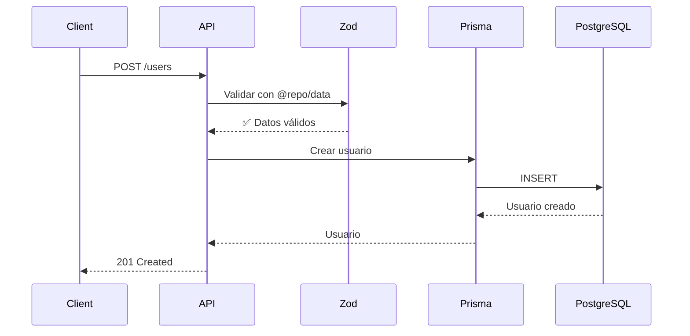

# 🏗️ Monorepo Architecture

Este documento proporciona una visión completa de la arquitectura técnica del monorepo, diseñado como una plataforma fullstack escalable con TypeScript.

---

## 📋 Tabla de Contenidos

1. [Visión General](#visión-general)
2. [Stack Tecnológico](#stack-tecnológico)
3. [Estructura del Monorepo](#estructura-del-monorepo)
4. [Aplicaciones (Apps)](#aplicaciones-apps)
5. [Paquetes Compartidos (Packages)](#paquetes-compartidos-packages)
6. [Tooling](#tooling)
7. [Flujo de Datos](#flujo-de-datos)
8. [Configuración de Build](#configuración-de-build)
9. [Base de Datos](#base-de-datos)
10. [Convenciones del Proyecto](#convenciones-del-proyecto)
11. [Comandos Principales](#comandos-principales)
12. [Dependencias entre Packages](#dependencias-entre-packages)

---

## 🌐 Visión General

Este proyecto es un **starter kit fullstack** diseñado siguiendo el patrón de **monorepo** utilizando:

- **Turborepo**: Para orquestar builds y cache inteligente
- **pnpm workspaces**: Para gestión eficiente de dependencias
- **TypeScript**: Como lenguaje base en todo el proyecto

### Arquitectura de Alto Nivel

```
┌─────────────────────────────────────────────────────────────────┐
│                        FULLSTACK MONOREPO                        │
├─────────────────────────────────────────────────────────────────┤
│                                                                  │
│  ┌─────────────┐     ┌─────────────┐                            │
│  │   CLIENT    │     │     API     │        APPLICATIONS        │
│  │  (Next.js)  │────▶│  (NestJS)   │                            │
│  │  Port 3001  │     │  Port 3000  │                            │
│  └─────────────┘     └──────┬──────┘                            │
│         │                   │                                    │
│         │           ┌───────┴───────┐                           │
│         │           │               │                            │
│         ▼           ▼               ▼                            │
│  ┌──────────────────────────────────────────────────────┐       │
│  │               SHARED PACKAGES                         │       │
│  ├──────────────────────────────────────────────────────┤       │
│  │  @repo/core   │  @repo/data  │  @repo/ui  │ @repo/   │       │
│  │  (constants)  │  (schemas)   │ (React UI) │  config  │       │
│  └──────────────────────────────────────────────────────┘       │
│                              │                                   │
│  ┌──────────────────────────────────────────────────────┐       │
│  │                     TOOLING                           │       │
│  ├──────────────────────────────────────────────────────┤       │
│  │  @repo/eslint │ @repo/typescript │ @repo/prettier │   │       │
│  │  @repo/jest   │ @repo/tailwind   │                    │       │
│  └──────────────────────────────────────────────────────┘       │
│                                                                  │
└─────────────────────────────────────────────────────────────────┘
                               │
                               ▼
               ┌───────────────────────────────┐
               │        INFRASTRUCTURE         │
               ├───────────────────────────────┤
               │  PostgreSQL  │     Redis      │
               │  (Docker)    │   (Docker)     │
               └───────────────────────────────┘
```

---

## 🛠️ Stack Tecnológico

### Backend (API)
| Tecnología | Versión | Propósito |
|------------|---------|-----------|
| NestJS | ^11.0.1 | Framework backend modular |
| Prisma ORM | ^6.14.0 | ORM type-safe para PostgreSQL |
| Zod | ^4.1.5 | Validación de schemas |
| PostgreSQL | 15 | Base de datos relacional |
| Redis | 7 | Cache y sesiones |
| Docker | - | Containerización |

### Frontend (Client)
| Tecnología | Versión | Propósito |
|------------|---------|-----------|
| Next.js | 15.5.2 | Framework React con SSR |
| React | 19.1.0 | Biblioteca UI |
| Shadcn/ui | latest | Componentes UI |
| Tailwind CSS | ^4 | Estilos utility-first |
| Turbopack | - | Bundler ultra-rápido |

### Monorepo & Tooling
| Tecnología | Versión | Propósito |
|------------|---------|-----------|
| Turborepo | ^2.5.6 | Orquestación de monorepo |
| pnpm | 9.15.4 | Gestión de dependencias |
| TypeScript | ^5.7.3 | Type-safety |
| ESLint | ^9 | Linting |
| Prettier | ^3 | Formateo de código |
| Husky | ^9 | Git hooks |
| Commitlint | ^19 | Conventional commits |

---

## 📁 Estructura del Monorepo

```
fullstack-starter/
├── apps/
│   ├── api/                 # Backend NestJS
│   └── client/              # Frontend Next.js
├── packages/
│   ├── config/              # Configuraciones compartidas
│   ├── core/                # Constantes y enums
│   ├── data/                # DTOs, schemas y validaciones (Zod)
│   └── ui/                  # Componentes React compartidos
├── tooling/
│   ├── eslint/              # Configuración ESLint
│   ├── jest/                # Configuración Jest
│   ├── prettier/            # Configuración Prettier
│   ├── tailwind/            # Configuración Tailwind
│   └── typescript/          # Configuración TypeScript base
├── docs/                    # Documentación del proyecto
├── package.json             # Root package.json
├── pnpm-workspace.yaml      # Configuración workspace
└── turbo.json               # Configuración Turborepo
```

---

## 📦 Aplicaciones (Apps)

### `apps/api` - Backend NestJS

API REST construida con NestJS que proporciona endpoints para la aplicación.

**Estructura:**
```
apps/api/
├── prisma/
│   ├── migrations/          # Migraciones de base de datos
│   ├── schema.prisma        # Schema de Prisma
│   └── seed.ts              # Seed de datos
├── src/
│   ├── common/              # Utilidades compartidas
│   ├── prisma/              # Módulo Prisma
│   ├── users/               # Módulo de usuarios (ejemplo)
│   ├── app.module.ts
│   └── main.ts              # Entry point
├── docker-compose.yml       # PostgreSQL + Redis
└── package.json
```

**Características principales:**
- ✅ Prisma ORM con PostgreSQL
- ✅ Validación con Zod (nestjs-zod)
- ✅ Swagger UI automático
- ✅ Docker Compose para desarrollo
- ✅ Filtros de excepciones globales
- ✅ Configuración de entorno con validación

**Puerto:** `3000`

---

### `apps/client` - Frontend Next.js

Aplicación web construida con Next.js 15 usando App Router y React Server Components.

**Estructura:**
```
apps/client/
├── src/
│   ├── app/
│   │   ├── layout.tsx       # Layout principal
│   │   ├── page.tsx         # Homepage
│   │   └── globals.css      # Estilos globales
│   ├── components/
│   │   └── ui/              # Componentes Shadcn/ui
│   └── lib/
│       └── utils.ts         # Utilidades (cn, etc.)
├── public/                  # Assets estáticos
├── components.json          # Configuración Shadcn/ui
└── package.json
```

**Características principales:**
- ✅ Next.js 15 con App Router
- ✅ React Server Components
- ✅ Turbopack para desarrollo
- ✅ Shadcn/ui pre-configurado
- ✅ Tailwind CSS v4
- ✅ TypeScript strict mode

**Puerto:** `3001`

---

## 📦 Paquetes Compartidos (Packages)

### `@repo/config`

Configuraciones compartidas y validación de variables de entorno.

```typescript
import { config } from '@repo/config';

// Variables validadas con Zod
console.log(config.DATABASE_URL);
console.log(config.JWT_SECRET);
```

**Exporta:**
- `config`: Variables de entorno validadas
- `validateEnv()`: Función de validación
- Tipos TypeScript inferidos

---

### `@repo/core`

Constantes y enums compartidos entre aplicaciones.

```typescript
import { UserRole } from '@repo/core';

const role: UserRole = UserRole.ADMIN;
```

**Exporta:**
- Enums: `UserRole`
- Constantes de la aplicación

---

### `@repo/data`

Schemas de validación con Zod y DTOs TypeScript.

```typescript
import { createUserSchema, type CreateUserDto } from '@repo/data';

// Validar datos
const result = createUserSchema.safeParse(userData);

// Tipos TypeScript automáticos
const user: CreateUserDto = {
  email: 'user@example.com',
  firstName: 'John',
  lastName: 'Doe',
};
```

**Estructura:**
```
packages/data/
├── src/
│   ├── schemas/             # Schemas Zod
│   │   ├── base.schema.ts
│   │   └── user.schema.ts
│   ├── validators/          # Validadores custom
│   └── index.ts
```

**Ventajas:**
- ✅ **Single Source of Truth**: Un schema para API y Client
- ✅ **Type-safe**: TypeScript inferido de Zod
- ✅ **Validación consistente**: Mismas reglas en backend y frontend
- ✅ **Reutilización**: Compartido entre aplicaciones

---

### `@repo/ui`

Componentes React reutilizables.

```typescript
import { Button } from '@repo/ui/button';

<Button variant="default">Click me</Button>
```

**Nota:** Los componentes de Shadcn/ui están en `apps/client/src/components/ui` por diseño, ya que son específicos de cada aplicación.

---

## 🔧 Tooling

### `@repo/eslint`

Configuraciones ESLint compartidas para diferentes tipos de proyectos.

**Configuraciones disponibles:**
- `base.js`: Configuración base TypeScript
- `nest.js`: Para aplicaciones NestJS
- `next.js`: Para aplicaciones Next.js
- `react-internal.js`: Para librerías React
- `library.js`: Para librerías TypeScript genéricas

### `@repo/typescript`

Configuraciones TypeScript compartidas.

**Configuraciones disponibles:**
- `base.json`: Base TypeScript
- `nestjs.json`: Para NestJS
- `nextjs.json`: Para Next.js
- `react-library.json`: Para librerías React

### `@repo/prettier`

Configuración Prettier consistente.

### `@repo/jest`

Configuraciones Jest para testing.

### `@repo/tailwind`

Configuración Tailwind CSS compartida.

---

## 🔄 Flujo de Datos

### 1. Cliente → API → Base de Datos



### 2. Validación Compartida

**Backend (NestJS):**
```typescript
import { createUserSchema } from '@repo/data';
import { z } from 'zod';

@UsePipes(ZodValidationPipe)
@Post()
async create(@Body(new ZodValidationPipe(createUserSchema)) dto: z.infer<typeof createUserSchema>) {
  return this.usersService.create(dto);
}
```

**Frontend (Next.js):**
```typescript
'use client';
import { createUserSchema } from '@repo/data';

const result = createUserSchema.safeParse(formData);
if (!result.success) {
  // Mostrar errores
  console.error(result.error);
}
```

---

## ⚙️ Configuración de Build

### Turborepo (`turbo.json`)

```json
{
  "$schema": "https://turbo.build/schema.json",
  "tasks": {
    "build": {
      "dependsOn": ["^build"],
      "outputs": ["dist/**", ".next/**"]
    },
    "dev": {
      "cache": false,
      "persistent": true
    },
    "lint": {
      "dependsOn": ["^build"]
    }
  }
}
```

**Características:**
- ✅ Cache inteligente de builds
- ✅ Ejecución paralela de tareas
- ✅ Dependencias automáticas entre packages
- ✅ Rebuilds incrementales

---

## 🗄️ Base de Datos

### Prisma Schema

El schema base incluye:
- Modelo `User` con autenticación
- Soft delete (`deletedAt`)
- Timestamps (`createdAt`, `updatedAt`)
- Roles de usuario (`UserRole` enum)

### Migrations

```bash
# Crear migración
pnpm --filter api run prisma:migrate

# Aplicar migraciones
pnpm --filter api run prisma:push

# Reset base de datos
pnpm --filter api run prisma:reset
```

### Seed Data

El seed crea usuarios de ejemplo:
- Admin: `admin@example.com` / `Password123!`
- User: `user@example.com` / `Password123!`

```bash
pnpm --filter api run prisma:seed
```

---

## 📏 Convenciones del Proyecto

### Nomenclatura

- **Archivos**: `kebab-case.ts`
- **Componentes React**: `PascalCase.tsx`
- **Variables/funciones**: `camelCase`
- **Constantes**: `UPPER_SNAKE_CASE`
- **Tipos/Interfaces**: `PascalCase`

### Estructura de Código

- **Exports con Barrels**: Usar `index.ts` para re-exportar
- **Imports absolutos**: Usar alias `@/` en aplicaciones
- **Type-first**: Definir tipos antes de implementación

### Git

- **Commits**: Conventional Commits (`feat:`, `fix:`, `chore:`, etc.)
- **Branches**: `feature/`, `fix/`, `chore/`
- **Hooks**: Husky para pre-commit y commit-msg

---

## 🚀 Comandos Principales

### Desarrollo

```bash
# Iniciar todo el proyecto
pnpm dev

# Iniciar solo API
pnpm dev:api

# Iniciar solo Client
pnpm dev:client
```

### Base de Datos

```bash
# Iniciar PostgreSQL y Redis
pnpm db:up

# Detener contenedores
pnpm db:down

# Abrir Prisma Studio
pnpm db:studio
```

### Build & Deploy

```bash
# Build todo
pnpm build

# Build API
pnpm build:api

# Build Client
pnpm build:client
```

### Linting & Formatting

```bash
# Lint todo
pnpm lint

# Lint con fix
pnpm lint:fix

# Format todo
pnpm format
```

### Testing

```bash
# Run tests
pnpm test

# E2E tests
pnpm test:e2e
```

---

## 🔗 Dependencias entre Packages

```
┌─────────────────────────────────────────────┐
│              APLICACIONES                    │
├─────────────────────────────────────────────┤
│                                              │
│  apps/api          apps/client              │
│     │                  │                     │
│     └─────────┬────────┘                     │
│               │                              │
└───────────────┼──────────────────────────────┘
                │
┌───────────────┼──────────────────────────────┐
│               │    SHARED PACKAGES            │
├───────────────┼──────────────────────────────┤
│               ▼                              │
│    ┌──────────────────────┐                 │
│    │    @repo/data        │                 │
│    │  (schemas + DTOs)    │                 │
│    └──────────────────────┘                 │
│               │                              │
│        ┌──────┴───────┐                     │
│        ▼              ▼                      │
│  ┌──────────┐  ┌──────────┐                │
│  │  @repo/  │  │  @repo/  │                │
│  │   core   │  │  config  │                │
│  └──────────┘  └──────────┘                │
│                                              │
└──────────────────────────────────────────────┘
```

**Reglas:**
- Apps pueden importar de cualquier package
- Packages solo importan de otros packages
- No hay dependencias circulares
- `@repo/data` es el más usado (schemas compartidos)

---

## 🎯 Ventajas de esta Arquitectura

### 1. **Type Safety End-to-End**
- Zod schemas en `@repo/data` → TypeScript inferido
- Mismo schema en API y Client
- Cambios en un lugar se propagan a toda la app

### 2. **DRY (Don't Repeat Yourself)**
- Schemas compartidos
- Componentes reutilizables
- Configuraciones centralizadas

### 3. **Escalabilidad**
- Fácil agregar nuevas apps
- Packages independientes
- Build incremental con Turborepo

### 4. **Developer Experience**
- Hot reload rápido
- Intellisense completo
- Errores en tiempo de desarrollo

### 5. **Mantenibilidad**
- Código organizado
- Cambios localizados
- Testing simplificado

---

## 🔐 Seguridad

- ✅ Validación de entorno en `@repo/config`
- ✅ Validación de datos con Zod
- ✅ Prisma previene SQL injection
- ✅ Variables sensibles en `.env` (gitignored)
- ✅ Bcrypt para passwords

---

## 📚 Recursos Adicionales

- [Turborepo Docs](https://turbo.build/repo/docs)
- [pnpm Workspaces](https://pnpm.io/workspaces)
- [NestJS Docs](https://docs.nestjs.com/)
- [Next.js Docs](https://nextjs.org/docs)
- [Prisma Docs](https://www.prisma.io/docs)
- [Zod Docs](https://zod.dev/)
- [Shadcn/ui](https://ui.shadcn.com/)

---

**¿Tienes preguntas sobre la arquitectura?** Revisa este documento o consulta la documentación oficial de las tecnologías utilizadas.
