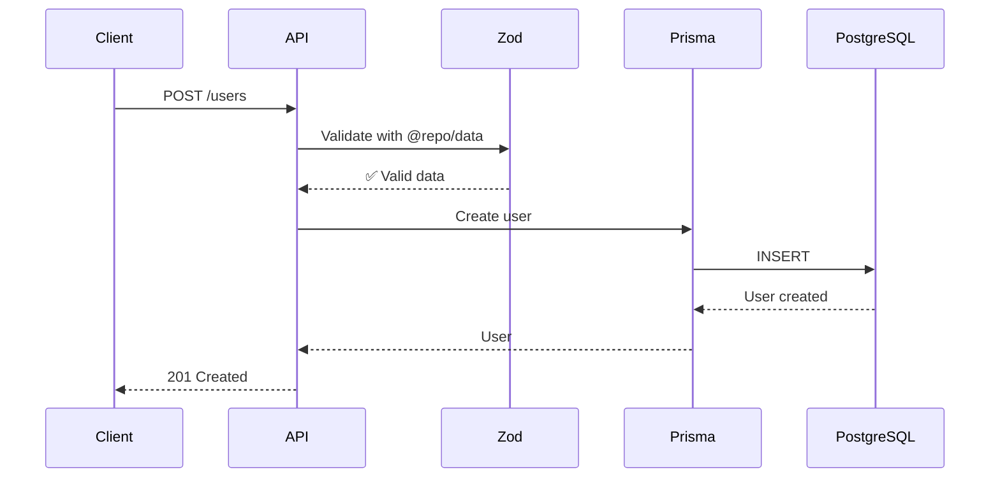

# 🏗️ Monorepo Architecture

This document provides a comprehensive view of the monorepo's technical architecture, designed as a scalable fullstack platform with TypeScript.

---

## 📋 Table of Contents

1. [Overview](#overview)
2. [Technology Stack](#technology-stack)
3. [Monorepo Structure](#monorepo-structure)
4. [Applications (Apps)](#applications-apps)
5. [Shared Packages](#shared-packages)
6. [Tooling](#tooling)
7. [Data Flow](#data-flow)
8. [Build Configuration](#build-configuration)
9. [Database](#database)
10. [Project Conventions](#project-conventions)
11. [Main Commands](#main-commands)
12. [Package Dependencies](#package-dependencies)

---

## 🌐 Overview

This project is a **fullstack starter kit** designed following the **monorepo** pattern using:

- **Turborepo**: For orchestrating builds and smart caching
- **pnpm workspaces**: For efficient dependency management
- **TypeScript**: As the base language throughout the project

### High-Level Architecture

```
┌─────────────────────────────────────────────────────────────────┐
│                        FULLSTACK MONOREPO                        │
├─────────────────────────────────────────────────────────────────┤
│                                                                  │
│  ┌─────────────┐     ┌─────────────┐                            │
│  │   CLIENT    │     │     API     │        APPLICATIONS        │
│  │  (Next.js)  │────▶│  (NestJS)   │                            │
│  │  Port 3001  │     │  Port 3000  │                            │
│  └─────────────┘     └──────┬──────┘                            │
│         │                   │                                    │
│         │           ┌───────┴───────┐                           │
│         │           │               │                            │
│         ▼           ▼               ▼                            │
│  ┌──────────────────────────────────────────────────────┐       │
│  │               SHARED PACKAGES                         │       │
│  ├──────────────────────────────────────────────────────┤       │
│  │  @repo/core   │  @repo/data  │  @repo/ui  │ @repo/   │       │
│  │  (constants)  │  (schemas)   │ (React UI) │  config  │       │
│  └──────────────────────────────────────────────────────┘       │
│                              │                                   │
│  ┌──────────────────────────────────────────────────────┐       │
│  │                     TOOLING                           │       │
│  ├──────────────────────────────────────────────────────┤       │
│  │  @repo/eslint │ @repo/typescript │ @repo/prettier │   │       │
│  │  @repo/jest   │ @repo/tailwind   │                    │       │
│  └──────────────────────────────────────────────────────┘       │
│                                                                  │
└─────────────────────────────────────────────────────────────────┘
                               │
                               ▼
               ┌───────────────────────────────┐
               │        INFRASTRUCTURE         │
               ├───────────────────────────────┤
               │  PostgreSQL  │     Redis      │
               │  (Docker)    │   (Docker)     │
               └───────────────────────────────┘
```

---

## 🛠️ Technology Stack

### Backend (API)
| Technology | Version | Purpose |
|------------|---------|---------|
| NestJS | ^11.0.1 | Modular backend framework |
| Prisma ORM | ^6.14.0 | Type-safe ORM for PostgreSQL |
| Zod | ^4.1.5 | Schema validation |
| PostgreSQL | 15 | Relational database |
| Redis | 7 | Cache and sessions |
| Docker | - | Containerization |

### Frontend (Client)
| Technology | Version | Purpose |
|------------|---------|---------|
| Next.js | 15.5.2 | React framework with SSR |
| React | 19.1.0 | UI library |
| Shadcn/ui | latest | UI components |
| Tailwind CSS | ^4 | Utility-first styling |
| Turbopack | - | Ultra-fast bundler |

### Monorepo & Tooling
| Technology | Version | Purpose |
|------------|---------|---------|
| Turborepo | ^2.5.6 | Monorepo orchestration |
| pnpm | 9.15.4 | Dependency management |
| TypeScript | ^5.7.3 | Type-safety |
| ESLint | ^9 | Linting |
| Prettier | ^3 | Code formatting |
| Husky | ^9 | Git hooks |
| Commitlint | ^19 | Conventional commits |

---

## 📁 Monorepo Structure

```
fullstack-starter/
├── apps/
│   ├── api/                 # Backend NestJS
│   └── client/              # Frontend Next.js
├── packages/
│   ├── config/              # Shared configurations
│   ├── core/                # Constants and enums
│   ├── data/                # DTOs, schemas and validations (Zod)
│   └── ui/                  # Shared React components
├── tooling/
│   ├── eslint/              # ESLint configuration
│   ├── jest/                # Jest configuration
│   ├── prettier/            # Prettier configuration
│   ├── tailwind/            # Tailwind configuration
│   └── typescript/          # Base TypeScript configuration
├── docs/                    # Project documentation
├── package.json             # Root package.json
├── pnpm-workspace.yaml      # Workspace configuration
└── turbo.json               # Turborepo configuration
```

---

## 📦 Applications (Apps)

### `apps/api` - Backend NestJS

REST API built with NestJS that provides endpoints for the application.

**Structure:**
```
apps/api/
├── prisma/
│   ├── migrations/          # Database migrations
│   ├── schema.prisma        # Prisma schema
│   └── seed.ts              # Seed data
├── src/
│   ├── common/              # Shared utilities
│   ├── prisma/              # Prisma module
│   ├── users/               # Users module (example)
│   ├── app.module.ts
│   └── main.ts              # Entry point
├── docker-compose.yml       # PostgreSQL + Redis
└── package.json
```

**Main features:**
- ✅ Prisma ORM with PostgreSQL
- ✅ Validation with Zod (nestjs-zod)
- ✅ Automatic Swagger UI
- ✅ Docker Compose for development
- ✅ Global exception filters
- ✅ Environment configuration with validation

**Port:** `3000`

---

### `apps/client` - Frontend Next.js

Web application built with Next.js 15 using App Router and React Server Components.

**Structure:**
```
apps/client/
├── src/
│   ├── app/
│   │   ├── layout.tsx       # Main layout
│   │   ├── page.tsx         # Homepage
│   │   └── globals.css      # Global styles
│   ├── components/
│   │   └── ui/              # Shadcn/ui components
│   └── lib/
│       └── utils.ts         # Utilities (cn, etc.)
├── public/                  # Static assets
├── components.json          # Shadcn/ui configuration
└── package.json
```

**Main features:**
- ✅ Next.js 15 with App Router
- ✅ React Server Components
- ✅ Turbopack for development
- ✅ Pre-configured Shadcn/ui
- ✅ Tailwind CSS v4
- ✅ TypeScript strict mode

**Port:** `3001`

---

## 📦 Shared Packages

### `@repo/config`

Configuraciones compartidas y validación de variables de entorno.

```typescript
import { config } from '@repo/config';

// Variables validadas con Zod
console.log(config.DATABASE_URL);
console.log(config.JWT_SECRET);
```

**Exporta:**
- `config`: Variables de entorno validadas
- `validateEnv()`: Función de validación
- Tipos TypeScript inferidos

---

### `@repo/core`

Constantes y enums compartidos entre aplicaciones.

```typescript
import { UserRole } from '@repo/core';

const role: UserRole = UserRole.ADMIN;
```

**Exporta:**
- Enums: `UserRole`
- Constantes de la aplicación

---

### `@repo/data`

Schemas de validación con Zod y DTOs TypeScript.

```typescript
import { createUserSchema, type CreateUserDto } from '@repo/data';

// Validar datos
const result = createUserSchema.safeParse(userData);

// Tipos TypeScript automáticos
const user: CreateUserDto = {
  email: 'user@example.com',
  firstName: 'John',
  lastName: 'Doe',
};
```

**Structure:**
```
packages/data/
├── src/
│   ├── schemas/             # Zod schemas
│   │   ├── base.schema.ts
│   │   └── user.schema.ts
│   ├── validators/          # Custom validators
│   └── index.ts
```

**Advantages:**
- ✅ **Single Source of Truth**: One schema for API and Client
- ✅ **Type-safe**: TypeScript inferred from Zod
- ✅ **Consistent validation**: Same rules in backend and frontend
- ✅ **Reusability**: Shared between applications

---

### `@repo/ui`

Reusable React components.

```typescript
import { Button } from '@repo/ui/button';

<Button variant="default">Click me</Button>
```

**Note:** Shadcn/ui components are in `apps/client/src/components/ui` by design, as they are specific to each application.

---

## 🔧 Tooling

### `@repo/eslint`

Configuraciones ESLint compartidas para diferentes tipos de proyectos.

**Configuraciones disponibles:**
- `base.js`: Configuración base TypeScript
- `nest.js`: Para aplicaciones NestJS
- `next.js`: Para aplicaciones Next.js
- `react-internal.js`: Para librerías React
- `library.js`: Para librerías TypeScript genéricas

### `@repo/typescript`

Configuraciones TypeScript compartidas.

**Configuraciones disponibles:**
- `base.json`: Base TypeScript
- `nestjs.json`: Para NestJS
- `nextjs.json`: Para Next.js
- `react-library.json`: Para librerías React

### `@repo/prettier`

Configuración Prettier consistente.

### `@repo/jest`

Configuraciones Jest para testing.

### `@repo/tailwind`

Configuración Tailwind CSS compartida.

---

## 🔄 Data Flow

### 1. Client → API → Database



### 2. Shared Validation

**Backend (NestJS):**
```typescript
import { createUserSchema } from '@repo/data';
import { z } from 'zod';

@UsePipes(ZodValidationPipe)
@Post()
async create(@Body(new ZodValidationPipe(createUserSchema)) dto: z.infer<typeof createUserSchema>) {
  return this.usersService.create(dto);
}
```

**Frontend (Next.js):**
```typescript
'use client';
import { createUserSchema } from '@repo/data';

const result = createUserSchema.safeParse(formData);
if (!result.success) {
  // Show errors
  console.error(result.error);
}
```

---

## ⚙️ Build Configuration

### Turborepo (`turbo.json`)

```json
{
  "$schema": "https://turbo.build/schema.json",
  "tasks": {
    "build": {
      "dependsOn": ["^build"],
      "outputs": ["dist/**", ".next/**"]
    },
    "dev": {
      "cache": false,
      "persistent": true
    },
    "lint": {
      "dependsOn": ["^build"]
    }
  }
}
```

**Features:**
- ✅ Smart build caching
- ✅ Parallel task execution
- ✅ Automatic dependencies between packages
- ✅ Incremental rebuilds

---

## 🗄️ Database

### Prisma Schema

The base schema includes:
- `User` model with authentication
- Soft delete (`deletedAt`)
- Timestamps (`createdAt`, `updatedAt`)
- User roles (`UserRole` enum)

### Migrations

```bash
# Create migration
pnpm --filter api run prisma:migrate

# Apply migrations
pnpm --filter api run prisma:push

# Reset database
pnpm --filter api run prisma:reset
```

### Seed Data

The seed creates example users:
- Admin: `admin@example.com` / `Password123!`
- User: `user@example.com` / `Password123!`

```bash
pnpm --filter api run prisma:seed
```

---

## 📏 Project Conventions

### Naming

- **Files**: `kebab-case.ts`
- **React Components**: `PascalCase.tsx`
- **Variables/functions**: `camelCase`
- **Constants**: `UPPER_SNAKE_CASE`
- **Types/Interfaces**: `PascalCase`

### Code Structure

- **Barrel exports**: Use `index.ts` for re-exporting
- **Absolute imports**: Use `@/` alias in applications
- **Type-first**: Define types before implementation

### Git

- **Commits**: Conventional Commits (`feat:`, `fix:`, `chore:`, etc.)
- **Branches**: `feature/`, `fix/`, `chore/`
- **Hooks**: Husky for pre-commit and commit-msg

---

## 🚀 Main Commands

### Development

```bash
# Start entire project
pnpm dev

# Start only API
pnpm dev:api

# Start only Client
pnpm dev:client
```

### Database

```bash
# Start PostgreSQL and Redis
pnpm db:up

# Stop containers
pnpm db:down

# Open Prisma Studio
pnpm db:studio
```

### Build & Deploy

```bash
# Build everything
pnpm build

# Build API
pnpm build:api

# Build Client
pnpm build:client
```

### Linting & Formatting

```bash
# Lint everything
pnpm lint

# Lint with fix
pnpm lint:fix

# Format everything
pnpm format
```

### Testing

```bash
# Run tests
pnpm test

# E2E tests
pnpm test:e2e
```

---

## 🔗 Package Dependencies

```
┌─────────────────────────────────────────────┐
│              APLICACIONES                    │
├─────────────────────────────────────────────┤
│                                              │
│  apps/api          apps/client              │
│     │                  │                     │
│     └─────────┬────────┘                     │
│               │                              │
└───────────────┼──────────────────────────────┘
                │
┌───────────────┼──────────────────────────────┐
│               │    SHARED PACKAGES            │
├───────────────┼──────────────────────────────┤
│               ▼                              │
│    ┌──────────────────────┐                 │
│    │    @repo/data        │                 │
│    │  (schemas + DTOs)    │                 │
│    └──────────────────────┘                 │
│               │                              │
│        ┌──────┴───────┐                     │
│        ▼              ▼                      │
│  ┌──────────┐  ┌──────────┐                │
│  │  @repo/  │  │  @repo/  │                │
│  │   core   │  │  config  │                │
│  └──────────┘  └──────────┘                │
│                                              │
└──────────────────────────────────────────────┘
```

**Rules:**
- Apps can import from any package
- Packages only import from other packages
- No circular dependencies
- `@repo/data` is the most used (shared schemas)

---

## 🎯 Advantages of this Architecture

### 1. **End-to-End Type Safety**
- Zod schemas in `@repo/data` → TypeScript inferred
- Same schema in API and Client
- Changes in one place propagate to the entire app

### 2. **DRY (Don't Repeat Yourself)**
- Shared schemas
- Reusable components
- Centralized configurations

### 3. **Scalability**
- Easy to add new apps
- Independent packages
- Incremental build with Turborepo

### 4. **Developer Experience**
- Fast hot reload
- Complete Intellisense
- Development-time errors

### 5. **Maintainability**
- Organized code
- Localized changes
- Simplified testing

---

## 🔐 Security

- ✅ Environment validation in `@repo/config`
- ✅ Data validation with Zod
- ✅ Prisma prevents SQL injection
- ✅ Sensitive variables in `.env` (gitignored)
- ✅ Bcrypt for passwords

---

## 📚 Additional Resources

- [Turborepo Docs](https://turbo.build/repo/docs)
- [pnpm Workspaces](https://pnpm.io/workspaces)
- [NestJS Docs](https://docs.nestjs.com/)
- [Next.js Docs](https://nextjs.org/docs)
- [Prisma Docs](https://www.prisma.io/docs)
- [Zod Docs](https://zod.dev/)
- [Shadcn/ui](https://ui.shadcn.com/)

---

**Have questions about the architecture?** Review this document or consult the official documentation of the technologies used.
